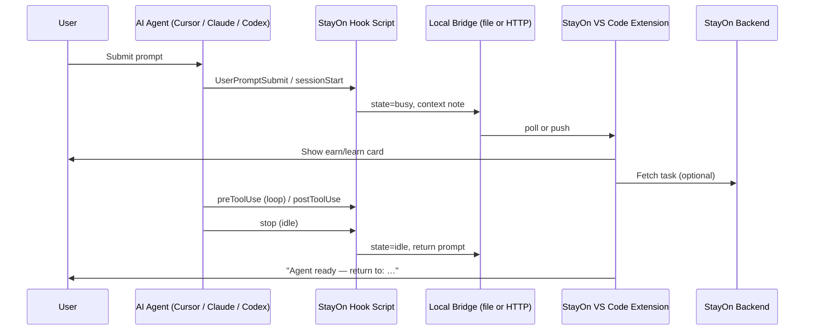

# StayOn Integration Options

This document reviews every practical way to integrate StayOn with AI coding agents — especially **Cursor IDE** — including the easiest paths, harder alternatives, barriers, and mitigations.

It builds on [01_product_overview.md](./01_product_overview.md).

---

## Executive Summary

| Path | Cursor IDE | Claude Code | OpenAI Codex | Hackathon fit |
|------|------------|-------------|--------------|---------------|
| **VS Code extension + side panel** | Good | Good | Good | Best demo surface |
| **Agent hooks → local state bridge** | Good | Best | Good | Best production trigger |
| **Status line (CLI text only)** | Limited | Good | Limited | Good for spinners, not microtasks |
| **Cursor plugin bundle** | Good | N/A | N/A | Good distribution |
| **Spinner/webview patching** | Fragile | Works (competitors do this) | Works | Fast but risky |
| **Cursor SDK** | Indirect | N/A | N/A | CI/automation only |
| **Desktop overlay** | Fallback | Fallback | Fallback | Agent-agnostic backup |

**Recommended hackathon stack:**

1. **VS Code extension** with a `WebviewView` side panel (works in VS Code and Cursor).
2. **Hooks** in `.cursor/hooks.json`, `.claude/settings.json`, and/or `.codex/hooks.json` to detect “agent is working” vs “agent is idle.”
3. A tiny **local bridge** (file or localhost HTTP) between hooks and the extension.
4. **Claude Code first**, then Codex, then Cursor-native agent — in that order for reliability.

StayOn should **not** depend on patching Claude/Codex extension bundles for the MVP. Competitors (Kickbacks, BoringSpinner, RuntimeAds) prove that model works short-term, but it is fragile, trust-hostile, and politically risky with platform vendors.

---

## 1. What StayOn Needs From the Host

StayOn is not a generic IDE plugin. It needs four signals from the host environment:

| Signal | Why StayOn needs it |
|--------|---------------------|
| **Wait start** | Open earning/learning/focus card |
| **Wait end** | Close card, show “return to context” |
| **Session context (optional)** | “You were refactoring `Button.tsx`” — no code/prompt reading by default |
| **Surface for UI** | Side panel, overlay, or status line |

No major agent exposes a single official API named “agent is thinking.” Every integration **infers** busy state from lifecycle events.

---

## 2. Integration Architecture (Recommended)

The most maintainable pattern across Cursor, Claude Code, and Codex:



### 2.1 Hook layer (detection)

Hooks are shell commands (or prompt hooks) that receive JSON on stdin and return JSON on stdout. They run at agent lifecycle points.

**Cursor** (`.cursor/hooks.json` or `~/.cursor/hooks.json`):

| Event | Use for StayOn |
|-------|----------------|
| `beforeSubmitPrompt` | Capture user intent note; mark session busy |
| `preToolUse` | Agent actively working (tool loop) |
| `postToolUse` | Still busy; refresh wait timer |
| `subagentStart` / `subagentStop` | Parallel subagent wait states |
| `afterAgentThought` | Long “thinking” blocks |
| `stop` | Agent idle; trigger return-to-context via `followup_message` (optional) |
| `sessionEnd` | Cleanup |

**Claude Code** (`~/.claude/settings.json` or project settings):

| Event | Use for StayOn |
|-------|----------------|
| `UserPromptSubmit` | Wait start + context capture |
| `PreToolUse` / `PostToolUse` | Sustained busy state |
| `Stop` | Wait end |
| `SubagentStart` / `SubagentStop` | Subagent parallelism |
| `SessionStart` / `SessionEnd` | Session bookkeeping |

**OpenAI Codex** (`~/.codex/hooks.json`, project `.codex/hooks.json`, or `config.toml`):

| Event | Use for StayOn |
|-------|----------------|
| `UserPromptSubmit` | Wait start |
| `PreToolUse` / `PostToolUse` | Busy loop |
| `SubagentStart` / `SubagentStop` | Subagents |
| `Stop` | Wait end |
| Turn lifecycle contributors (extensions) | Read-only observation for Codex plugins |

Hook scripts should be **fast** (<500ms). Heavy work (fetching surveys, rendering UI) belongs in the extension or backend, not in the hook.

### 2.2 Bridge layer (hook → extension)

Hooks cannot open VS Code webviews directly. Use one of:

| Bridge | Pros | Cons |
|--------|------|------|
| **State file** (`~/.stayon/state.json`) | Simple, no server | Polling latency (~500ms) |
| **Localhost HTTP** (`127.0.0.1:PORT`) | Instant push | Slightly more setup |
| **VS Code command via CLI** | Tight integration | Requires `cursor`/`code` CLI and open workspace |

For hackathon MVP, a state file plus extension polling every 300–500ms is enough.

Example state shape:

```json
{
  "agent": "cursor",
  "status": "busy",
  "since": "2026-06-20T10:00:00Z",
  "context_note": "Refactor Button.tsx and add tests",
  "session_id": "abc123"
}
```

### 2.3 UI layer (VS Code extension)

Build a standard VS Code extension with:

- **`WebviewView` side panel** — primary surface for surveys, quizzes, focus prompts
- **Status bar item** — “StayOn: earning…” / coin balance
- **Commands** — toggle modes (Earn / Learn / Focus), open dashboard
- **Settings** — API keys, privacy toggles, disable earning

This extension runs in:

- VS Code + Claude Code extension
- VS Code + Codex extension
- **Cursor** (VS Code fork — same extension APIs)
- Windsurf and other VS Code derivatives (with marketplace caveats)

---

## 3. Cursor IDE — Detailed Options

Cursor is VS Code-based but owns the native Agent UI. Integration depth varies.

### 3.1 Option A: VS Code extension + Cursor hooks (recommended)

**Difficulty:** Medium  
**Official support:** Yes (hooks + extension APIs)  
**Best for:** Hackathon MVP and long-term Cursor support

**How it works:**

1. Ship StayOn as a VS Code extension (Open VSX + optional `.vsix`).
2. On install, offer to add `.cursor/hooks.json` entries (or user-level `~/.cursor/hooks.json`).
3. Hook scripts update the local bridge when Cursor Agent runs tools or stops.
4. Extension panel opens when `status=busy`.

**Pros:**

- No modification of Cursor internals
- Aligns with StayOn privacy story (hooks only see what Cursor already exposes)
- Supports return-to-context via `stop` hook `followup_message`
- Works with Cursor CLI agent as well as IDE

**Cons:**

- No access to Cursor’s native chat spinner — panel is separate from the agent UI
- User must trust/install hooks (Cursor shows hook review UI)
- Busy detection is inferred, not guaranteed for every sub-state (e.g. streaming text before first tool call)

**Mitigations:**

- Treat `beforeSubmitPrompt` as busy immediately (optimistic open)
- Use `preToolUse` to confirm sustained work
- Close panel on `stop` with status `completed` / `aborted`
- Add manual “I’m waiting” button as fallback

### 3.2 Option B: Cursor plugin (`.cursor-plugin/`)

**Difficulty:** Medium  
**Official support:** Yes (Cursor Marketplace)

Cursor plugins bundle rules, skills, agents, commands, MCP servers, and **hooks** into one distributable package. StayOn can ship:

```
stayon-plugin/
  .cursor-plugin/plugin.json
  hooks/hooks.json
  hooks/stayon-busy.sh
  rules/ ...
```

**Pros:**

- One-click install for hooks + guidance
- Marketplace discovery
- `workspaceOpen` hook can enable plugin per repo

**Cons:**

- Plugins do not replace a full webview extension — still need the VS Code extension for rich UI
- Manual review before listing

**Mitigation:** Ship **plugin (hooks + config) + extension (UI)** as a pair.

### 3.3 Option C: Cursor status line (CLI only)

**Difficulty:** Easy  
**Official support:** Yes (`~/.cursor/cli-config.json`)

Cursor CLI supports a `statusLine` command (aligned with Claude Code). The JSON payload includes `model.param_summary` (e.g. `"(Thinking)"`), context usage, cwd, and session metadata.

**Pros:**

- Official, lightweight
- Good for “Earn while you wait” one-liner + link
- No hook trust for display-only scripts

**Cons:**

- **Text only** — not suitable for interactive surveys or multi-step tasks
- Primarily CLI, not the graphical Agent panel
- Updates debounced (≥300ms)

**Mitigation:** Use status line as a **teaser** (“StayOn: 12 coins — open panel”) that deep-links to the extension webview.

### 3.4 Option D: Cursor SDK (`@cursor/sdk` / `cursor-sdk`)

**Difficulty:** Medium–Hard  
**Official support:** Yes (public beta)

The SDK runs Cursor agents programmatically from scripts, CI, or backends. `run.stream()` and `run.wait()` expose agent lifecycle outside the IDE.

**Pros:**

- Clean busy/idle semantics for **automated** agents
- Cloud agents visible in Cursor Agents window
- Good for team analytics and batch microtasks

**Cons:**

- **Not for typical Cursor IDE users** sitting in the editor
- Requires API key and separate runtime
- Does not hook into interactive IDE chat directly

**Mitigation:** Use SDK for **StayOn Team Mode** / analytics backend, not the consumer hackathon demo.

### 3.5 Option E: Patch / inject into agent UI (not recommended)

Competitors inject ads into Claude Code/Codex **webview bundles** or spinner verbs. Some also modify `~/.claude/settings.json` (`statusLine`, `spinnerVerbs`).

**Pros:**

- Maximum visibility (spinner real estate)
- Proven revenue model (Kickbacks, BoringSpinner, RuntimeAds)

**Cons:**

- Breaks on every agent extension update
- Triggers security review backlash (CSP changes, modified third-party files)
- Conflicts with Anthropic’s public positioning against ads in Claude
- Hard to reconcile with StayOn’s trust/privacy principles
- Cursor may block or sandbox similar behavior in native Agent UI

**Mitigation:** Avoid for StayOn MVP. If ever used, treat as optional “compact mode” with full reversibility and open-source patch logic.

---

## 4. Claude Code Integration

Claude Code is the **easiest first agent target** (as noted in the product overview).

### 4.1 Supported surfaces

| Surface | Mechanism | StayOn use |
|---------|-----------|------------|
| Terminal CLI | Hooks + `statusLine` + `subagentStatusLine` | Wait detection + compact earn line |
| VS Code extension panel | StayOn side panel + hooks in project | Full microtask UI |
| Cursor + Claude Code ext | Same as VS Code | Works today (competitors claim Cursor support) |

### 4.2 Hook events (mirror Cursor)

Claude Code hooks support command, HTTP, and prompt handlers. Key events: `UserPromptSubmit`, `PreToolUse`, `PostToolUse`, `Stop`, `SubagentStart`, `SubagentStop`, `SessionStart`, `SessionEnd`.

Install flow for users:

1. Install StayOn VS Code extension.
2. Run “Enable Claude Code integration” command → writes hook entries to `~/.claude/settings.json` or `.claude/settings.json`.
3. User trusts hooks in Claude Code (`/hooks`).

### 4.3 Status line integration

Claude Code’s status line runs a command on each refresh with rich session JSON (model, cost, rate limits, cwd, tasks). StayOn can:

- Show coin balance and “tap to open panel”
- Detect active subagents via `subagentStatusLine`

Limitation: interactive tasks still need the webview panel.

---

## 5. OpenAI Codex Integration

Codex is the **second priority** — strategically important, similar hook model to Claude Code.

### 5.1 Hooks

Codex discovers hooks in:

- `~/.codex/hooks.json`
- `~/.codex/config.toml`
- Project `.codex/hooks.json` (requires project trust)
- Plugin bundles (`.codex-plugin/plugin.json`)

Events include `UserPromptSubmit`, `PreToolUse`, `PostToolUse`, `Stop`, `SubagentStart`, `SubagentStop`, `SessionStart`, and compaction events.

Users must review/trust hooks via `/hooks` in the Codex CLI (similar friction to Cursor).

### 5.2 Codex IDE extension

The Codex VS Code extension shares the same hook/runtime as CLI. StayOn side panel + `.codex/hooks.json` in the workspace is the clean path.

**Hackathon simple mode:** show StayOn panel whenever Codex hooks report busy — even without parsing Codex UI internals.

### 5.3 Codex extension API (future)

Codex exposes **lifecycle contributors** for plugins (`TurnLifecycleContributor`, `ToolLifecycleContributor`, `ThreadLifecycleContributor`). These are read-only observation signals — ideal for analytics and precise wait metering, but require building a Codex plugin/extension, not just shell hooks.

Use this in Phase 2+ for accurate “turn in progress” telemetry.

---

## 6. Other Agents (Future)

| Agent | Integration approach | Notes |
|-------|---------------------|-------|
| **GitHub Copilot** | Limited in Cursor (not on OpenVSX); VS Code only | No hook ecosystem comparable to Claude/Codex |
| **Windsurf** | VS Code extension + custom hooks if exposed | Research per release |
| **JetBrains AI** | Separate plugin platform | Different codebase entirely |
| **Terminal-only agents (Aider, etc.)** | File watcher on transcript + manual trigger | Coarse detection |
| **Browser AI builders** | Browser extension | Different product surface |

---

## 7. Hackathon Demo Paths (Ranked)

### Path 1 — Simulated wait (fastest)

Build the extension + mock `setTimeout` busy states. No agent integration required for the pitch video.

- **Time:** hours
- **Risk:** none
- **Story:** “This is the UX; real hooks connect in Phase 2”

### Path 2 — Claude Code hooks + panel (best live demo)

Real busy/idle with Claude Code in VS Code or Cursor.

- **Time:** 1–2 days
- **Risk:** hook trust UX on stage

### Path 3 — Codex hooks + panel

Same architecture, `.codex/hooks.json`.

- **Time:** 1–2 days after Claude path works

### Path 4 — Cursor native Agent hooks

`.cursor/hooks.json` targeting Cursor’s built-in Agent (not Claude Code).

- **Time:** 1 day once bridge exists
- **Risk:** slightly less documented edge cases (stop hook followups, background tasks)

---

## 8. Barriers and Mitigations

### 8.1 No official “agent is thinking” API

**Barrier:** Hosts expose lifecycle events, not a single busy flag. Gap between prompt submit and first tool call may not fire `preToolUse` immediately.

**Mitigations:**

- Mark busy on `beforeSubmitPrompt` / `UserPromptSubmit`
- Reset idle on `stop` with terminal status
- Extension-side timeout if no events for N minutes
- Manual “Start wait session” button

### 8.2 Hooks cannot render rich UI

**Barrier:** Hook scripts run headless with strict timeouts.

**Mitigations:**

- Local bridge + VS Code webview (recommended architecture)
- Keep hooks to <50 lines: write JSON state only

### 8.3 Hook trust and security friction

**Barrier:** Cursor, Codex, and Claude Code require users to review and trust hook definitions. Enterprise environments may lock hooks down.

**Mitigations:**

- One-click setup command with clear explanation
- Ship hooks as part of signed plugin / open-source repo users can audit
- Document `failClosed` behavior; default fail-open for StayOn telemetry
- Team Mode: MDM/managed hooks for enterprises

### 8.4 Cursor marketplace vs VS Code marketplace

**Barrier:** Cursor uses **Open VSX**, not the Microsoft Marketplace. Some extensions are missing or outdated.

**Mitigations:**

- Publish to Open VSX under StayOn publisher
- Provide `.vsix` download from GitHub releases
- Document manual “Install from VSIX” for demo machines
- Avoid dependencies on Microsoft-proprietary extensions

### 8.5 Separate UI from native agent spinner

**Barrier:** StayOn panel competes for attention with the agent chat, not inside the spinner. Lower impression density than Kickbacks-style injection.

**Mitigations:**

- **Differentiate on product:** microtasks, learning, focus — not passive spinner ads
- Auto-focus panel only during verified busy state
- Compact status bar entry + optional sound when agent completes
- Optional status-line teaser for CLI users

### 8.6 Platform policy and vendor backlash

**Barrier:** Anthropic has publicly resisted ads in Claude. OpenAI and Cursor may restrict monetization overlays in agent UI. Competitors already face reputational scrutiny for patching vendor extensions.

**Mitigations:**

- StayOn positioning: **productivity layer**, not “ads in your spinner”
- No silent modification of third-party extension files
- Explicit opt-in, transparent sponsored labels
- Privacy-first defaults (no code/prompt reading)
- Prepare for API/platform partnership conversation rather than adversarial patching

### 8.7 Developer trust and privacy

**Barrier:** Developers fear extensions that read code, prompts, or exfiltrate repo metadata.

**Mitigations:**

- Local-first state; no cloud without consent
- Open-source hook scripts and extension client
- Codebase Mode off by default
- Clear data policy in extension manifest and settings

### 8.8 Competitive landscape

**Barrier:** Kickbacks.ai, BoringSpinner, and RuntimeAds already monetize Claude Code/Codex wait time with spinner/status-line ads and revenue share.

**Mitigations:**

- StayOn’s breadth (earn + learn + focus + codebase + team) is the moat
- Higher-trust integration model (hooks + panel vs bundle patching)
- Developer microtasks (AI feedback, labeling) — higher CPM than generic ads
- Team/enterprise plans competitors do not emphasize

### 8.9 Reward API and payout complexity

**Barrier:** Real money requires offerwall/postback integration, fraud prevention, KYC/payout rails.

**Mitigations:**

- Hackathon: mock coins + one real or sandbox offer API (BitLabs, etc.)
- Phase 2: ledger + Stripe Connect (see competitor patterns)
- Start with points and gift cards before cash

### 8.10 Multi-agent and subagent concurrency

**Barrier:** Multiple subagents or parallel tools create overlapping “wait” windows.

**Mitigations:**

- Reference counting in bridge (`busy_count`)
- `subagentStart` / `subagentStop` hooks
- UI shows aggregate “2 agents working” state

### 8.11 Cursor-specific hook edge cases

**Barrier:** Reports of `stop` hook follow-ups not landing after background tasks; matchers use JavaScript regex (easy to misconfigure).

**Mitigations:**

- Test without matchers first
- Avoid long-running stop hooks
- Return-to-context as extension notification, not only hook follow-up

---

## 9. Recommended Implementation Plan

### Phase 0 — Hackathon (3–5 days)

1. VS Code extension with `WebviewView` panel and mock tasks.
2. Simulated busy state + return-to-context notification.
3. Optional: Claude Code hooks writing to `~/.stayon/state.json`.
4. One reward provider sandbox or hardcoded sponsored card.

### Phase 1 — Real agent integrations

1. Generalize hook scripts (`stayon-busy.sh`, `stayon-idle.sh`) for Claude, Codex, Cursor.
2. Install wizard in extension.
3. Earn + Learn + Focus modes.
4. Points wallet in extension storage / backend.

### Phase 2 — Cursor-native polish

1. Cursor plugin on Marketplace (hooks bundle).
2. Cursor CLI status line teaser.
3. Improved busy detection (`afterAgentThought`, subagents).

### Phase 3 — Platform depth

1. Codex lifecycle contributor plugin for precise metering.
2. Cursor SDK pipeline for team analytics.
3. Sponsored card marketplace + developer microtask network.

---

## 10. Decision Matrix: Where to Start

| If your priority is… | Start with… |
|---------------------|-------------|
| Fastest demo video | Mock busy state in extension |
| Easiest real integration | Claude Code hooks + panel |
| Strategic OpenAI alignment | Codex hooks (same bridge code) |
| Cursor IDE users specifically | `.cursor/hooks.json` + extension in Cursor |
| Long-term enterprise | Hooks + backend + Team Mode (no spinner patching) |
| Maximum ad impressions | Status line / spinner (competitor path — not recommended for StayOn brand) |

---

## 11. Conclusion

**Yes, Cursor IDE can integrate with StayOn** through the same practical path as Claude Code and Codex:

> **VS Code extension (UI) + agent hooks (detection) + local bridge (glue)**

This is the **easy, official, maintainable** route. It works in Cursor today without patching Cursor or Claude binaries.

Cursor is “harder” only in the sense that its native Agent UI does not offer a sponsored spinner slot — StayOn’s panel sits beside the agent, not inside it. That is a **product design tradeoff**, not a blocker. It aligns with StayOn’s broader positioning beyond spinner ads.

For the hackathon, build the extension and simulated wait first, then wire Claude Code hooks, then Codex, then Cursor native hooks — reusing one bridge and one panel for all three.

---

## References

- [Cursor hooks](https://cursor.com/docs) — project `.cursor/hooks.json`, events through agent lifecycle
- [Cursor plugins](https://cursor.com/docs/plugins) — bundle hooks for distribution
- [Cursor SDK](https://cursor.com/docs/sdk/typescript) — programmatic agents (CI/cloud)
- [Claude Code hooks](https://code.claude.com/docs/en/hooks) — lifecycle interception
- [Claude Code status line](https://code.claude.com/docs/en/statusline) — CLI footer customization
- [OpenAI Codex hooks](https://developers.openai.com/codex/hooks) — hook config and trust flow
- Competitor reference points: Kickbacks.ai, BoringSpinner, RuntimeAds (spinner/status-line monetization)
