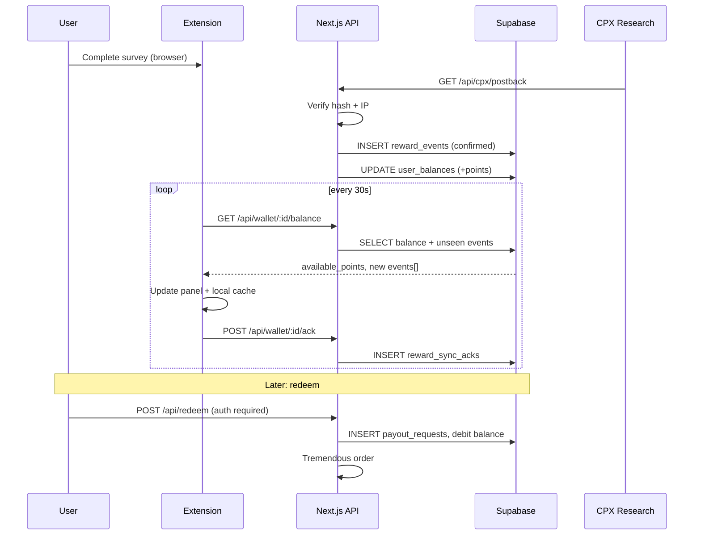

# StayOn Supabase data model

What to persist in Postgres (via **Supabase**), how real earnings should be tracked, and how that connects to payouts later.

Related:

- [10_backend_web_app.md](./10_backend_web_app.md) — backend phases (B–E)
- [06_real_monetization_playbook.md](./06_real_monetization_playbook.md) — monetization + ledger rules
- [12_backend_developer_guide.md](./12_backend_developer_guide.md) — API conventions
- [09_cpx_postback_setup.md](./09_cpx_postback_setup.md) — CPX postback fields
- [18_supabase_implementation_roadmap.md](./18_supabase_implementation_roadmap.md) — phased build order + SQL migration

---

## 1. Problem today

StayOn has **split persistence**:

| Layer | Where | What | Survives redeploy? | Withdrawable? |
|-------|--------|------|--------------------|---------------|
| CPX money events | `web/.data/ledger.json` | Postback rows + `synced` flag | **No** on Vercel | Indirectly (after extension sync) |
| Survey targeting | `web/.data/user-profiles.json` | Email, DOB, geo | **No** | N/A |
| Display balance + gamification | Extension `globalState` (`stayon.wallet`) | Points, XP, streaks, history | Per machine only | **No** (local only) |
| User identity | Extension `globalState` (`stayon.userId`) | Random UUID = CPX `ext_user_id` | Per machine only | N/A |

**Gaps for real earnings:**

1. No **authoritative server balance** — extension wallet can drift, reinstall, or double-credit on ack failure.
2. No **user account** linking extension UUID → email/login → payout recipient.
3. No **audit trail** for publisher revenue vs user share vs StayOn margin.
4. Learn/perk points are **local only** — fine for engagement, but must not mix with withdrawable balance without rules.
5. JSON files are lost on serverless redeploy unless external storage is added.

**Goal:** Supabase becomes the **system of record** for identity, paid reward events, balances, and (later) payout requests. The extension remains the UX layer; it **reads** balance from the server and **caches** gamification locally.

---

## 2. Design principles

### 2.1 Two point buckets

| Bucket | Source | Server ledger? | Cash redeem? |
|--------|--------|----------------|--------------|
| **Earned (paid)** | CPX postback, future BitLabs/sponsors | **Yes** — immutable events | **Yes** (above threshold) |
| **Engagement** | Learn (1 ⭐), flow bonus, perks, streaks | Optional mirror (analytics only) | **No** |

Economy constants (from `extension/src/gamification/economy.ts`):

- `1 ⭐ ≈ €0.0001` (`POINT_TO_EUR = 0.0001`)
- CPX: `tokens = round(amount_usd × 10_000 × CPX_USER_SHARE)` (default share `0.5`)
- Redeem minimum (planned): `5_000 ⭐` ≈ **€0.50** at current rate (product may raise to €5+ for payouts)

**Rule:** Only rows in `reward_events` with `bucket = 'earned'` and `status = 'confirmed'` increase `available_points` for payout.

### 2.2 Immutable event log + materialized balance

Use an **append-only reward event log** plus a **balance row per user** updated in the same DB transaction as postback insert.

```
CPX postback → INSERT reward_events → UPDATE user_balances (pending or available)
Extension poll → GET balance + new events → display → POST ack (device sync cursor)
Redeem → INSERT payout_requests → debit available_points (when provider confirms)
```

Never delete reward events; cancelations get `status = 'canceled'` and a compensating balance adjustment.

### 2.3 Extension `userId` is not a login

Today `stayon.userId` is a device-scoped UUID used as CPX `ext_user_id`. In Supabase:

- Keep it as **`extension_user_id`** on `extension_installs` (or `devices`).
- Later link to **`auth.users`** via `user_accounts` when the user signs in on the web.

One human can have multiple extension installs; payouts attach to the **account**, not a single UUID.

### 2.4 Secrets stay server-side

CPX `CPX_SECURE_HASH`, Tremendous API keys, Supabase **service role** key — only in `web/.env.local` / Vercel env. Extension uses `stayon.apiBaseUrl` + optional device token after Phase C.

---

## 3. Entity inventory (what to save)

### 3.1 Core identity

| Entity | Purpose | Today | Supabase table |
|--------|---------|-------|----------------|
| Account | Human user (future login) | — | `profiles` (extends `auth.users`) |
| Extension install | Device/extension UUID | `stayon.userId` | `extension_installs` |
| Account ↔ install link | Merge balances across machines | — | `extension_installs.user_id` FK |

**`profiles`** (public, 1:1 with Supabase Auth):

| Column | Type | Notes |
|--------|------|-------|
| `id` | `uuid` PK | `auth.users.id` |
| `display_name` | `text` | optional |
| `payout_email` | `text` | Tremendous/PayPal recipient (verified later) |
| `country_code` | `char(2)` | optional, for compliance |
| `created_at` | `timestamptz` | |

**`extension_installs`**:

| Column | Type | Notes |
|--------|------|-------|
| `id` | `uuid` PK | Same as current `stayon.userId` / CPX `ext_user_id` |
| `user_id` | `uuid` FK nullable | Set when user links account |
| `editor` | `text` | `cursor` \| `vscode` |
| `extension_version` | `text` | from `package.json` version |
| `last_seen_at` | `timestamptz` | heartbeat from extension |
| `created_at` | `timestamptz` | |

### 3.2 Survey targeting (CPX profile)

| Entity | Purpose | Today | Supabase table |
|--------|---------|-------|----------------|
| Survey profile | CPX targeting, skip signup form | `user-profiles.json` | `survey_profiles` |

**`survey_profiles`** (1:1 with `extension_installs.id`):

| Column | Type | Notes |
|--------|------|-------|
| `extension_user_id` | `uuid` PK FK | |
| `email` | `text` | **PII** — RLS restrict; never return full email to client except owner |
| `birthday_year` | `smallint` | |
| `birthday_month` | `smallint` | |
| `birthday_day` | `smallint` | |
| `gender` | `text` | `m` \| `f` optional |
| `country_code` | `char(2)` | |
| `zip_code` | `text` | optional |
| `completed_at` | `timestamptz` | |

Migrate from `web/src/lib/userProfile.ts` shape.

### 3.3 Paid earnings (system of record)

| Entity | Purpose | Today | Supabase table |
|--------|---------|-------|----------------|
| Reward event | Every CPX/BitLabs/sponsor credit | `ledger.json` entries | `reward_events` |
| Balance | Withdrawable + pending totals | computed in extension wallet | `user_balances` |
| Device sync cursor | Which events extension applied | `synced` boolean on ledger row | `reward_sync_ack` |

**`reward_events`** (immutable log):

| Column | Type | Notes |
|--------|------|-------|
| `id` | `uuid` PK | internal |
| `external_trans_id` | `text` UNIQUE | CPX `trans_id` — **dedupe key** |
| `extension_user_id` | `uuid` FK | |
| `provider` | `text` | `cpx` \| `bitlabs` \| `sponsor` |
| `provider_status` | `text` | raw CPX `status` |
| `event_type` | `text` | `complete` \| `bonus` \| `screenout` \| `cancel` |
| `status` | `text` | `pending` \| `confirmed` \| `canceled` |
| `bucket` | `text` | `earned` (default) |
| `amount_usd_publisher` | `numeric(12,4)` | what CPX paid StayOn |
| `amount_usd_user_share` | `numeric(12,4)` | after `CPX_USER_SHARE` |
| `points` | `integer` | user-facing ⭐ credited |
| `offer_id` | `text` | CPX offer |
| `session_id` | `text` | CPX `subid_1` / wait session |
| `ip_click` | `text` | fraud forensics |
| `metadata` | `jsonb` | extra query params |
| `created_at` | `timestamptz` | |
| `updated_at` | `timestamptz` | status changes |

Maps 1:1 from `web/src/lib/ledger.ts` `LedgerEntry` + richer provider field.

**`user_balances`** (one row per `extension_user_id`, later per `user_id` when linked):

| Column | Type | Notes |
|--------|------|-------|
| `extension_user_id` | `uuid` PK FK | |
| `available_points` | `integer` | redeemable |
| `pending_points` | `integer` | confirmed but not yet synced to extension (optional) |
| `lifetime_earned_points` | `integer` | analytics |
| `lifetime_redeemed_points` | `integer` | |
| `updated_at` | `timestamptz` | |

**`reward_sync_acks`** (replaces blind `synced` flag — supports multi-device):

| Column | Type | Notes |
|--------|------|-------|
| `extension_user_id` | `uuid` | |
| `reward_event_id` | `uuid` FK | |
| `acked_at` | `timestamptz` | |
| PK | `(extension_user_id, reward_event_id)` | |

### 3.4 Payouts (Phase E — schema now, implement later)

**`payout_requests`**:

| Column | Type | Notes |
|--------|------|-------|
| `id` | `uuid` PK | |
| `user_id` | `uuid` FK | `auth.users` — required for payout |
| `points` | `integer` | debited from available |
| `amount_eur` | `numeric(12,4)` | `points × 0.0001` |
| `method` | `text` | `tremendous_gift_card` \| `paypal` \| `stripe_connect` |
| `recipient_email` | `text` | |
| `provider` | `text` | `tremendous` |
| `provider_order_id` | `text` | external id |
| `status` | `text` | `requested` \| `processing` \| `paid` \| `failed` \| `canceled` |
| `failure_reason` | `text` | |
| `created_at` | `timestamptz` | |
| `completed_at` | `timestamptz` | |

**`payout_events`** (audit):

| Column | Type | Notes |
|--------|------|-------|
| `id` | `uuid` PK | |
| `payout_request_id` | `uuid` FK | |
| `status` | `text` | |
| `payload` | `jsonb` | provider webhook body |
| `created_at` | `timestamptz` | |

### 3.5 Engagement / gamification (optional server mirror)

Can stay in extension `globalState` for MVP+. Add server tables when you need cross-device streaks or anti-cheat on Learn.

**`engagement_events`** (optional Phase 2):

| Column | Type | Notes |
|--------|------|-------|
| `id` | `uuid` PK | |
| `extension_user_id` | `uuid` FK | |
| `kind` | `text` | `learn` \| `flow_bonus` \| `perk_redeem` \| `streak` |
| `points` | `integer` | non-withdrawable |
| `label` | `text` | |
| `created_at` | `timestamptz` | |

**`learn_completions`** (when `POST /api/learn/complete` ships):

| Column | Type | Notes |
|--------|------|-------|
| `id` | `uuid` PK | |
| `extension_user_id` | `uuid` | |
| `task_id` | `text` | |
| `completed_at` | `timestamptz` | |
| UNIQUE | `(extension_user_id, task_id, date)` | rate limit |

### 3.6 Publisher / unit economics (internal analytics)

**`publisher_revenue_daily`** (optional rollup):

| Column | Type |
|--------|------|
| `date` | `date` |
| `provider` | `text` |
| `gross_usd` | `numeric` |
| `user_share_usd` | `numeric` |
| `stayon_margin_usd` | `numeric` |

Derive from `reward_events` or materialized view.

### 3.7 What stays local (extension only)

Keep in `globalState` unless product needs sync:

| Key | Reason to stay local |
|-----|----------------------|
| `stayon.cpxSession` | UI state — paused iframe URL |
| `stayon.wallet` badges, XP, level, streaks | Fast UX; non-monetary |
| Perk flags (`flowBoostPending`, etc.) | Session boosts |
| Webview UI state | Ephemeral |

After DB migration, **`stayon.wallet.tokens` for paid portion** should be seeded from `GET /api/wallet/:id/balance` on activate, not only local increments.

---

## 4. Earnings flow (target architecture)



### 4.1 Postback → balance (server transaction)

On CPX postback (`web/src/app/api/cpx/postback/route.ts` logic):

1. Validate hash + IP.
2. Upsert `reward_events` on `external_trans_id` (idempotent).
3. If `status = confirmed` and points > 0:
   - `user_balances.lifetime_earned_points += points`
   - `user_balances.available_points += points` (or `pending_points` if you want extension-ack first)
4. If `status = canceled` (CPX `status=2`): mark canceled; if previously credited, subtract points once.

**StayOn margin** (analytics, not stored per row initially):

```
stayon_margin_usd = amount_usd_publisher - amount_usd_user_share
```

### 4.2 Extension sync (replace current ack-only model)

Current flow (`extension/src/api/rewardSync.ts`):

1. GET pending → credit **local** wallet → POST ack.

**Target flow:**

1. `GET /api/wallet/:extensionUserId/summary` returns `{ availablePoints, pendingPoints, cashEstimate, recentEvents[] }`.
2. Extension sets **display balance** from server for earned bucket; merges local engagement points for total UI if desired.
3. `POST /api/wallet/:extensionUserId/ack` with `eventIds[]` — marks device caught up (for notifications only; balance already on server).

This fixes double-credit: server balance is truth; ack is not a second credit.

### 4.3 Redeem (later)

Prerequisites:

- User signed in (`auth.users`) and `payout_email` verified.
- `available_points >= REDEEM_MIN_POINTS` (5000).
- Linked `extension_installs.user_id` aggregates balance OR redeem only from account-level balance.

Flow:

1. `POST /api/redeem` `{ points, method }` with Supabase JWT.
2. Debit `user_balances` in transaction; insert `payout_requests`.
3. Call Tremendous sandbox/production API.
4. Webhook updates `payout_requests.status`.

---

## 5. API mapping (current → future)

| Current route | JSON file | Future Supabase |
|---------------|-----------|-----------------|
| `GET /api/cpx/postback` | `ledger.json` upsert | `reward_events` + `user_balances` |
| `GET /api/wallet/:id/pending` | filter unsynced | `reward_events` where not ack'd OR return balance delta |
| `POST /api/wallet/:id/ack` | `synced = true` | `reward_sync_acks` insert |
| `GET/POST/DELETE /api/user/:id/profile` | `user-profiles.json` | `survey_profiles` |
| — | — | `GET /api/wallet/:id/summary` **new** |
| — | — | `POST /api/redeem` **new** (auth) |
| `GET /api/learn/task` | in-memory | `learn_tasks` table (content) |

---

## 6. Row Level Security (RLS) sketch

| Table | anon / extension | authenticated user | service role (API) |
|-------|------------------|--------------------|--------------------|
| `reward_events` | no direct access | read own via `user_id` join | full (postback handler) |
| `user_balances` | no | read own | full |
| `survey_profiles` | no | read/write own install | full |
| `payout_requests` | no | read/create own | full |
| `extension_installs` | no | read own linked | full |

Postback and CPX wall routes use **Supabase service role** in Next.js server only — never expose to extension.

---

## 7. Migration from JSON (one-time)

1. Export `web/.data/ledger.json` → insert `reward_events` + recompute `user_balances`.
2. Export `web/.data/user-profiles.json` → `survey_profiles` + ensure `extension_installs` rows exist.
3. Deploy API with feature flag `STORAGE_BACKEND=json|supabase`.
4. When stable, remove JSON writers in `web/src/lib/ledger.ts` and `userProfile.ts`.

Script location (to build): `web/scripts/migrate-json-to-supabase.ts`.

---

## 8. Environment variables (Supabase)

```bash
# web/.env.local
NEXT_PUBLIC_SUPABASE_URL=https://xxxx.supabase.co
NEXT_PUBLIC_SUPABASE_ANON_KEY=eyJ...          # client / future web dashboard
SUPABASE_SERVICE_ROLE_KEY=eyJ...              # server-only — postback, admin
STORAGE_BACKEND=supabase                        # or json during transition
```

Keep existing CPX vars: `CPX_APP_ID`, `CPX_SECURE_HASH`, `CPX_USER_SHARE`.

---

## 9. Success metrics (DB-enabled)

Once live, you can query:

- **User LTV:** `sum(points) group by extension_user_id`
- **Pending liability:** `sum(available_points) × 0.0001` EUR
- **Publisher gross vs user share:** `sum(amount_usd_publisher)`, `sum(amount_usd_user_share)`
- **Fraud:** duplicate `external_trans_id`, velocity per IP / per user per day
- **Conversion:** installs with `reward_events` / total installs

---

## 10. Open product decisions

| Decision | Options | Recommendation |
|----------|---------|----------------|
| Balance before extension ack | Credit immediately vs `pending_points` | Credit `available_points` on postback; ack is UI sync only |
| Learn points on server | Mirror vs local-only | Local-only until anti-cheat needed |
| Redeem minimum | 5,000 ⭐ (€0.50) vs €5 | Raise to €5 before Tremendous production |
| Account linking | Magic link vs GitHub OAuth | GitHub first (dev audience) |
| Multi-install balance | Sum per account vs per device | Sum per `user_id` when linked |

---

## 11. File reference (current code)

| Concern | Path |
|---------|------|
| JSON ledger | `web/src/lib/ledger.ts` |
| JSON profiles | `web/src/lib/userProfile.ts` |
| CPX postback | `web/src/app/api/cpx/postback/route.ts` |
| Pending / ack | `web/src/app/api/wallet/[userId]/pending/route.ts`, `ack/route.ts` |
| Token math | `web/src/lib/cpx.ts` → `usdToTokens()` |
| Extension sync | `extension/src/api/rewardSync.ts` |
| Local wallet | `extension/src/gamification/wallet.ts`, `streaks.ts` |
| Economy constants | `extension/src/gamification/economy.ts` |

SQL starter: [web/supabase/migrations/001_initial_schema.sql](../web/supabase/migrations/001_initial_schema.sql)

Implementation order: [18_supabase_implementation_roadmap.md](./18_supabase_implementation_roadmap.md)
