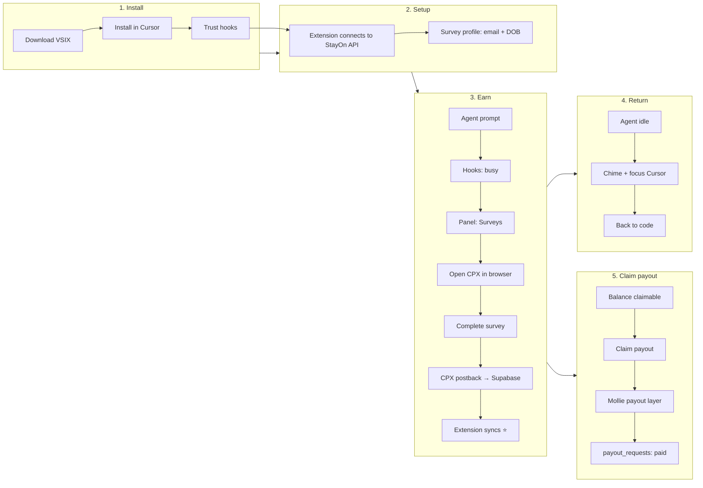

# Ship plan: beta testers → earn → get paid

Actionable roadmap from **today’s codebase** to **other people can install, complete surveys, and see real earnings** — then claim payout.

> **Hackathon focus (now):** Share extension + show income. See [22_hackathon_share_guide.md](./22_hackathon_share_guide.md). **Claim/Mollie is P3**, not blocking testers.

Related:

- [19_possiblities.md](./19_possiblities.md) — options we explored (not all will be built)
- [19_02_possiblities_trucks.md](./19_02_possiblities_trucks.md) — **MEGATHON tracks + Mollie payout strategy**
- [18_supabase_implementation_roadmap.md](./18_supabase_implementation_roadmap.md) — database phases (0–2 done in code)
- [06_real_monetization_playbook.md](./06_real_monetization_playbook.md) — Tremendous / BitLabs (alternative payout path)
- [15_extension_backend_config.md](./15_extension_backend_config.md) — `stayon.apiBaseUrl`
- [14_extension_dev_workflow.md](./14_extension_dev_workflow.md) — F5 dev workflow

---

## 1. Where we are now

### Working end-to-end (you, local/dev)

| Step | Status | Notes |
|------|--------|-------|
| Cursor hooks → busy detection | ✅ | `.cursor/hooks/stayon-event.sh` → localhost bridge |
| Panel on agent wait | ✅ | Surveys / Learn / Perks |
| CPX surveys | ✅ | Wall + external browser; profile form |
| CPX postback → ledger | ✅ | Hash + IP validation |
| Supabase persistence | ✅ | When env set (`STORAGE_BACKEND=supabase`) |
| Extension balance sync | ✅ | `GET /api/wallet/:id/summary` every 30s |
| Agent-ready alert | ✅ | Sound + focus Cursor (macOS) |

### Not working for strangers yet

| Gap | Why it blocks beta |
|-----|-------------------|
| Hooks not in VSIX | Testers must manually copy `.cursor/` into their project |
| Empty `BUNDLED_API_BASE_URL` | Testers must set `stayon.apiBaseUrl` by hand |
| Backend on localhost | CPX postback cannot reach your laptop |
| No VSIX release channel | No standard “install this” link |
| **Cash redeem / claim** | UI disabled; no Mollie claim API yet |
| **Web login** | No account to attach payout identity |
| Terms / privacy | Needed before real money |

---

## 2. Full lifecycle (pitch + engineering map)

This is the story you tell investors/testers and the order we build.



### Step-by-step (user-facing)

1. **Install** — Download `stayon-0.1.0.vsix`, install via Cursor Extensions → Install from VSIX.
2. **Enable hooks** — Copy hook files (or run future installer), trust in Cursor Settings → Hooks.
3. **Connect backend** — Automatic if VSIX bundles production URL; else set `stayon.apiBaseUrl` once.
4. **Survey profile** — One-time email + birthday in StayOn panel (CPX targeting).
5. **Use Agent** — Submit any Agent prompt; StayOn opens when hooks fire.
6. **Surveys mode** — Click **Open in browser**, complete a CPX survey while the agent works.
7. **Points arrive** — Within ~30s, ⭐ increase (server sync); confetti on new rewards.
8. **Agent finishes** — Chime + Cursor comes forward; survey can stay open (pause/resume).
9. **Learn / Perks** — Optional; 1 ⭐ flashcards and perk spends are **not** withdrawable.
10. **Claim payout** *(next build)* — Balance ≥ threshold → **Claim payout** → Mollie (sandbox OK for demo) → `payout_requests` marked `paid` in Supabase.

### Pitch line (MEGATHON)

> CPX/partners create earning events. Supabase stores the ledger. **Mollie handles the claim/payout layer.** StayOn is the reward layer for AI-agent idle time — detect wait, serve paid tasks, track confirmed earnings, let users claim rewards.

---

## 3. What’s remaining (by priority)

### P0 — Share & see income (hackathon — **do this first**)

| # | Task | Status |
|---|------|--------|
| 1 | Deploy `web/` to Vercel + CPX postback + Supabase | You (ops) |
| 2 | `BUNDLED_API_BASE_URL` → production URL in VSIX | ✅ in code |
| 3 | **`StayOn: Install Hooks in Workspace`** command | ✅ in code |
| 4 | **`/earnings?userId=`** — server balance + history | ✅ in code |
| 5 | **`/try`** page + **`GET /api/stats/summary`** | ✅ in code |
| 6 | Package VSIX + GitHub Release + link `/try` | You |
| 7 | Wallet → **View earnings online** in extension | ✅ in code |

**Exit criteria:** 3+ people complete a survey; `/try` stats increase; each person opens their earnings URL.

### P0b — Beta polish (if time before demo)

| # | Task | Effort |
|---|------|--------|
| 8 | Terms + privacy (minimal) | ½ day |
| 9 | Build-in-Public posts (clips + metrics) | ongoing |

**Exit criteria (old P0):** A friend installs VSIX only, runs installer, completes survey, sees ⭐ + earnings page.

### P1 — Trust + polish for beta

| # | Task | Effort |
|---|------|--------|
| 7 | Extension fetches `GET /api/config` on activate (fallback URL) | ½ day |
| 8 | Minimal Terms + Privacy pages on `web/` | 1 day |
| 9 | Web **earnings page** (read-only): balance + history by `userId` query | 1–2 days |
| 10 | Fix `docs/10_backend_web_app.md` checkboxes (Supabase done) | 30 min |
| 11 | Optional: Open VSX listing | 1 day |

### P2 — Claim payout (Mollie — **after** real usage demo)

Targets **MEGATHON Startup Track** + **Mollie bounty**. Sandbox is enough for judges; do not block demo on production payouts.

| # | Task | Effort |
|---|------|--------|
| 12 | Create **Mollie account** (Startup Track requirement) | You (ops) | 1 hr |
| 13 | Web dashboard: earned / pending / **claimable** / paid totals | 1–2 days |
| 14 | `POST /api/claim` — create `payout_requests`, debit `user_balances` | 1–2 days |
| 15 | Mollie sandbox: payment or Connect payout status flow | 1–2 days |
| 16 | Mollie webhook → update `payout_requests.status` | 1 day |
| 17 | Enable Wallet **Claim payout** button (extension → web or in-panel) | 1 day |
| 18 | Rules: min threshold, **earned-only** (exclude Learn/perks) | ½ day |
| 19 | Optional: Supabase Auth + link extension UUID before claim | 2–3 days |

**Fast demo (minimum):** Claim button → Mollie test payment → one `payout_requests` row → show `paid` in dashboard.

**Stronger demo:** Frame StayOn as marketplace; Mollie Connect for “connect payout account.”

**Exit criteria:** Judge can see claim flow end-to-end in sandbox; Supabase shows ledger + payout record.

### P2b — Alternative payout (post-hackathon)

| # | Task | Notes |
|---|------|-------|
| Tremendous gift cards | [06_real_monetization_playbook.md](./06_real_monetization_playbook.md) | US/global; not MEGATHON-critical |
| Stripe Connect | Bank payout at scale | Later |

### P3 — After beta / post-MEGATHON

- CPX API-native survey list (fixes in-panel redirect issues)
- BitLabs as second provider
- Tremendous gift cards (P2b)
- Fraud velocity limits on claim
- Stripe Connect for bank payout
- Marketplace / Open VSX public listing

---

## 3b. MEGATHON demo must-haves (from trucks doc)

Before Sunday demo, prioritize in this order:

1. Obvious paid survey flow (external browser)
2. Proof of **real** CPX reward in dashboard / Supabase
3. Wallet UI: **earned / pending / claimable / paid**
4. **Claim payout** button + Mollie test flow (even sandbox)
5. 90-second pitch: problem → solution → built → **Mollie claim layer** → business
6. Build-in-Public posts (4–6 clips: demo, reward proof, architecture, final demo)

Tracks to target: **Startup**, **Mollie bounty**, **Build-in-Public**, optional **Pixverse video**.

See [19_02_possiblities_trucks.md](./19_02_possiblities_trucks.md) for full track breakdown.

---

## 4. Your manual checklist (ops)

### A. Vercel deploy

```bash
cd web && vercel
```

Required env (production):

```bash
CPX_APP_ID=
CPX_SECURE_HASH=
CPX_USER_SHARE=0.5          # or 0.7 — match economics you promise users
NEXT_PUBLIC_APP_URL=https://your-app.vercel.app
NEXT_PUBLIC_SUPABASE_URL=
NEXT_PUBLIC_SUPABASE_PUBLISHABLE_KEY=
SUPABASE_SECRET_KEY=
STORAGE_BACKEND=supabase
# NEVER: CPX_SKIP_IP_CHECK=true
```

Verify:

```bash
curl https://your-app.vercel.app/api/config
curl "https://your-app.vercel.app/api/cpx/availability?userId=YOUR-UUID"
```

### B. CPX publisher dashboard

1. [publisher.cpx-research.com](https://publisher.cpx-research.com) → your app
2. **Main Postback URL** — copy template from `https://your-app.vercel.app/setup`
3. Confirm server IP whitelist (Vercel egress or CPX IPs in `web/src/lib/cpx.ts`)
4. Test postback from CPX test tools or complete a real survey

### C. Supabase

- Schema already applied (`web/supabase/migrations/001_initial_schema.sql`)
- Confirm tables: `extension_installs`, `survey_profiles`, `reward_events`, `user_balances`
- Optional: migrate old JSON: `cd web && npm run db:migrate-json`

### D. Extension release

```bash
cd extension
# Set BUNDLED_API_BASE_URL in src/api/defaults.ts first
npm run compile
npx vsce package --no-dependencies
```

Upload `stayon-0.1.0.vsix` to GitHub Releases; link from README and `/setup`.

### E. Mollie (when building P2 — **do this before Tremendous**)

1. Create account at [mollie.com](https://www.mollie.com) (required for MEGATHON Startup Track)
2. Enable **test mode** / sandbox API keys
3. Env (add to `web/.env.example` when implemented):

```bash
MOLLIE_API_KEY=test_...
MOLLIE_PROFILE_ID=...
MOLLIE_WEBHOOK_SECRET=...   # if using webhooks
```

4. Implement claim flow per [19_02_possiblities_trucks.md](./19_02_possiblities_trucks.md) §“Add Mollie as the Claim Rewards layer”
5. For demo: one successful test payout + row in `payout_requests` with `provider = 'mollie'`

### F. Tremendous (optional — P2b)

1. [developers.tremendous.com](https://developers.tremendous.com) sandbox
2. Use only if you need US gift-card path after MEGATHON

---

## 5. Beta tester onboarding (copy-paste for friends)

Send testers this sequence:

1. **Install** — Download VSIX from [release link], Cursor → Extensions → `...` → Install from VSIX.
2. **Hooks** — In your project root, add StayOn hooks (from repo `.cursor/hooks.json` + `stayon-event.sh`), `chmod +x` the script, trust in **Cursor Settings → Hooks**.
3. **Backend** — If panel says “Connect backend”, set `stayon.apiBaseUrl` to `https://your-app.vercel.app` (or skip if bundled).
4. **Profile** — StayOn panel → set survey profile (real email, correct country).
5. **Run** — Agent prompt → panel opens → Surveys → **Open in browser** → complete survey.
6. **Verify** — ⭐ balance updates within 30s; agent finish plays chime.
7. **Stuck?** — `StayOn: Reset Survey Identity`, check `StayOn: Show Debug Output`, try external browser not in-panel list.

---

## 6. Economics to communicate honestly

From `extension/src/gamification/economy.ts`:

- **1 ⭐ ≈ €0.0001** (display estimate)
- **CPX:** `points = USD_payout × 10,000 × CPX_USER_SHARE` (server)
- **Learn:** 1 ⭐, local only, **not withdrawable**
- **Redeem minimum (planned):** 5,000 ⭐ ≈ €0.50 display — raise for production to cover Mollie fees
- **Claim:** earned CPX balance only; Learn/perks excluded

Tell testers: *“Survey points are confirmed on our server; claim via Mollie coming in next release.”*

---

## 7. Code map (what to build next)

| Feature | Primary files |
|---------|----------------|
| Bundled API URL | `extension/src/api/defaults.ts` |
| Remote config on activate | `extension/src/extension.ts`, `extension/src/api/stayonApi.ts` |
| Hook installer | `extension/src/setup/installHooks.ts`, new command in `package.json` |
| Earnings dashboard | `web/src/app/dashboard/` or extend `/setup` |
| Mollie claim API | `web/src/app/api/claim/route.ts`, `web/src/lib/mollie.ts` |
| Mollie webhook | `web/src/app/api/webhooks/mollie/route.ts` |
| Claim payout UI | `extension/media/panel/main.ts` (~line 680) — rename from “Redeem cash” |
| Earned vs engagement split | `extension/src/types.ts`, `rewardSync.ts` |
| Tremendous (optional) | `web/src/lib/tremendous.ts` — P2b only |

---

## 8. Suggested timeline

| Week | Goal |
|------|------|
| **Week 1** | P0: Vercel + CPX live, VSIX release, 3–5 friends earn CPX points |
| **Week 2** | P1: hook installer, earnings dashboard (pending/confirmed/claimable), build-in-public posts |
| **Week 3** | P2: **Mollie claim sandbox** end-to-end (MEGATHON demo) |
| **Week 4+** | P2b Tremendous optional; P3 polish, Open VSX |

---

## 9. Success metrics

| Metric | How to measure |
|--------|----------------|
| Installs | VSIX downloads / `extension_installs` row count |
| Hook success | % testers with `busy_start` in StayOn output |
| Survey completes | `reward_events` with `status=confirmed` |
| Sync health | `reward_sync_acks` / confirmed events ratio |
| Claim (Mollie) | `payout_requests.status=paid` and `provider=mollie` |
| Liability | `sum(user_balances.available_points) × 0.0001` EUR |

---

## 10. Risks

| Risk | Mitigation |
|------|------------|
| CPX 0 surveys for user | Reset identity, fix email, match IP country; see `/api/cpx/availability` |
| Hooks untrusted | Installer + verify command + doc screenshots |
| Double credit | Server `external_trans_id` unique; extension `lastServerEarnedPoints` delta |
| Payout > revenue | Monitor Supabase balances vs CPX dashboard gross |
| Vercel redeploy data loss | `STORAGE_BACKEND=supabase` (already implemented) |

---

## 11. Summary

**You can demo the full *earn* loop today** with local backend + F5. **Strangers can test** after P0 (deploy + VSIX + hook docs). **Claim payout** needs P2 (**Mollie** sandbox + claim API + dashboard).

**Next action (today):**

1. Deploy `web/` to Vercel with Supabase + CPX env  
2. Paste CPX postback URL  
3. Set `BUNDLED_API_BASE_URL` → package VSIX → send to 1 tester  

**Next action (dev — MEGATHON):**

1. Earnings dashboard with **pending / confirmed / claimable / paid**  
2. **Mollie sandbox** + `POST /api/claim` + Claim button  
3. Hook installer (P0) if time before demo
